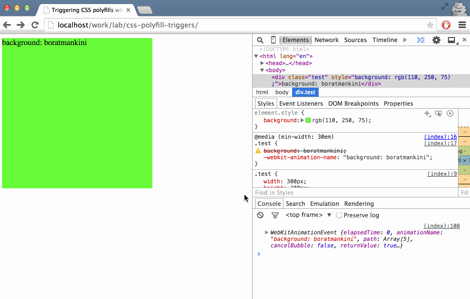

# CSS polyfills triggered by CSS Animations

This basic example demonstrates how to trigger CSS polyfills with CSS Animations events.

## The idea

This technique works by encoding the polyfill-able CSS declaration as the name of a CSS animation which is applied to target elements. A script listens at runtime for `animationStart` events, decodes the animation name into a property/value pair and calls any registered CSS polyfills for it.

## Pros

- This approach removes the need for using an expensive JavaScript-driven CSS parser at runtime;

- Relying on the native CSS engine to apply CSS animations according to media queries, selector specificity and cascade also removes the need for complex JavaScript logic in determining when and what to polyfill;

- CSS animation events are triggered for each selector target individually;

## Cons

- Complications may arise when applying this polyfill-triggering technique with CSS Animations used for their intended purposes. However, it is possible to use multiple animations on the same target element.

- Manually adding & maintaining CSS Animations as polyfill triggers is prone to human error. Using a CSS post-processor might be more suitable.

- This technique may be limited to polyfilling property/value pairs. Polyfills for selectors or CSS Rules like `@supports` do not benefit from this animation-triggered behavior.

- CSS animations are not supported in older browsers.

## Thoughts

If you find this interesting, let's talk. I'm [@razvancaliman](https://twitter.com/razvancaliman) on Twitter.
